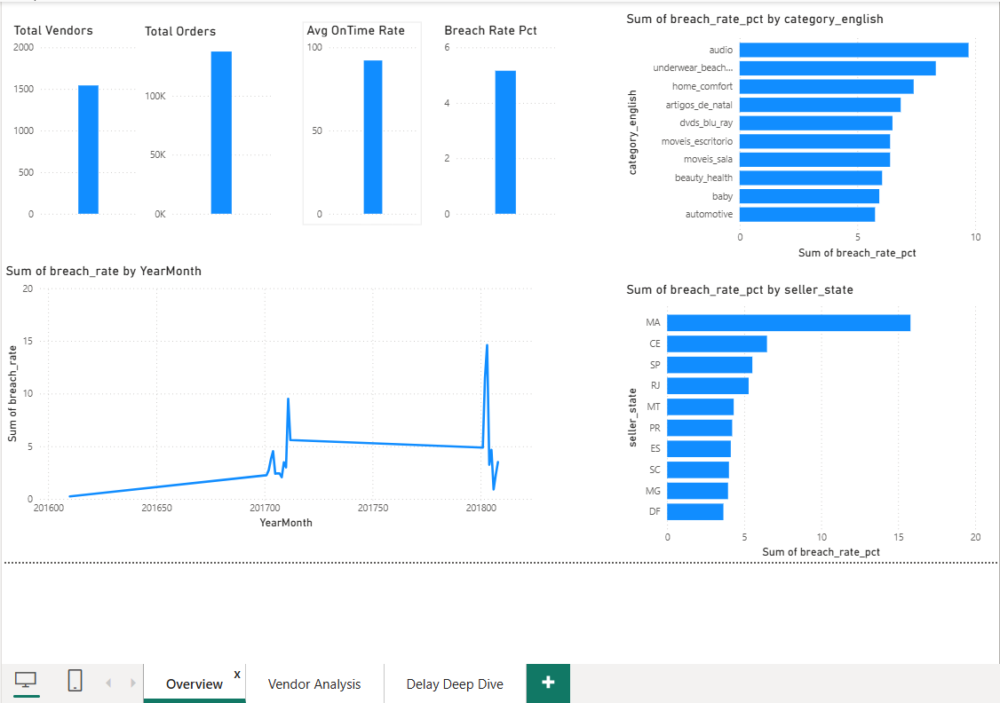

# Supply Chain Delay & Vendor Performance Tracker

End-to-end SQL-heavy analytics on 96,469 delivered orders from the Brazilian E-Commerce (Olist) dataset — SLA breach detection, vendor performance scoring, and delay root cause analysis across an 8-table relational schema.

---

## Problem statement
E-commerce platforms lose customer trust when deliveries breach promised dates, but most operations teams lack visibility into which vendors, regions, and product categories drive delays. This project builds a complete delay diagnostics system — from raw transactional data to an actionable vendor scorecard and operational dashboard.

---

## Tech stack
| Tool | Purpose |
|------|---------|
| Python (pandas) | Multi-table merging, feature engineering, cleaning |
| SQL (MySQL) | All analysis — CTEs, window functions, multi-table JOINs |
| Excel | Vendor scorecard with RAG conditional formatting |
| Power BI | 3-page interactive dashboard |

---

## Dataset
**Source:** Brazilian E-Commerce Public Dataset by Olist (Kaggle)  
**Size:** 96,469 delivered orders across 8 relational tables (orders, items, sellers, products, reviews, customers)  
**Link:** kaggle.com/datasets/olistbr/brazilian-ecommerce

---

## Key findings
- SLA breaches correlate with a 54% drop in customer review scores (4.21 → 1.93)
- Transit time is the primary delay driver — breached orders average 29.5 transit days vs 7.35 for on-time orders, while seller processing only differs by ~3.5 days
- Cross-state deliveries breach at more than 2x the rate of same-state deliveries (6.35% vs 3.07%) with 2.6x longer transit time
- Extra Heavy products (>10kg) breach at 7.39% vs 4.85% for Light products — weight is a meaningful delay predictor
- Maranhão (MA) state has a 15.8% breach rate — nearly 3x the national average
- Vendor tiering (NTILE quartiles) shows a clear performance gradient: Gold tier averages 100% on-time rate vs 80.36% for At-Risk tier

---

## SQL techniques used
- CTEs (WITH clauses) for modular, readable multi-step logic
- Window functions: RANK(), NTILE(4), LAG() for month-over-month trend analysis
- CASE-based SLA classification and weight bucketing
- Multi-table JOINs across orders, items, sellers, products, reviews
- Composite scoring with weighted business logic
- HAVING clauses for statistical significance filtering

See the .sql files in this repo for all three analysis modules.

---

## Vendor scorecard (Excel)
A 4-sheet workbook simulating a real consulting deliverable:
- **Summary** — executive KPI overview
- **Vendor Scorecard** — 1,542 vendors with RAG conditional formatting, tier-based color coding, and composite score data bars
- **Category Analysis** — breach rate heatmap by product category
- **State Analysis** — breach rate heatmap by geography

---

## Dashboard preview

### Overview

### Vendor Analysis

### Delay Deep Dive

[Full PDF export available here](supply_chain_dashboard.pdf)

---

## Project structure

supply-chain-analytics/
│
├── Supply_Chain_Analytics.ipynb
├── 01_sla_analysis.sql
├── 02_vendor_scorecard.sql
├── 03_root_cause_and_trends.sql
├── vendor_scorecard.xlsx
├── supply_chain_dashboard.pbix
├── supply_chain_dashboard.pdf
├── Overview.png
├── Vendor Analysis.png
├── Delay Deep Dive.png
└── README.md

---

## Author
**Dhananjay** | Mechanical Engineering (EV specialization) → Data Analytics  
[LinkedIn]((https://www.linkedin.com/in/dhananjaylingam/))
